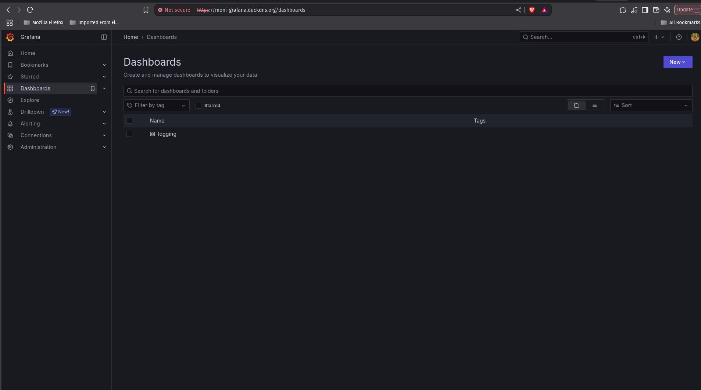
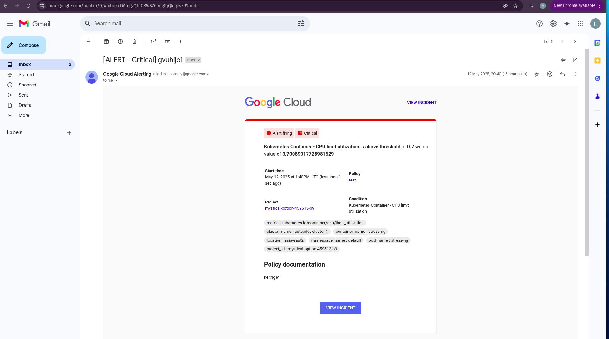

# MrScraper DevOps Technical Test

## ✅ Objective

Deploy a sample landing page web application using Docker and Kubernetes with full observability (monitoring & alerting), autoscaling, and reverse proxying to domain.

---

## ⚡ Deployment Overview

### Tech Stack:

* **Cloud Provider**: Google Cloud Platform (GKE Autopilot)
* **Container Registry**: Docker Hub
* **Ingress Controller**: NGINX Ingress
* **Monitoring**: Prometheus + Grafana
* **Alerting**: GCP Cloud Monitoring + Slack & Email
* **Autoscaler**: HPA (Horizontal Pod Autoscaler) + KEDA (optional installed)
* **Domain Management**: DuckDNS (free dynamic DNS)

---

### 1. Dockerize Application

* Simple landing page app containerized using Docker
* Docker image pushed to Docker Hub: `dzikrihuda/mrscraper-app:latest`

### 2. Kubernetes Manifests

* Namespace: `default`
* Deployment: `landing`
* Service: `landingpage-svc` (type `ClusterIP`)
* Ingress: exposed via NGINX controller

### 3. Autoscaling Setup

* Installed HPA for `landing` app
* Configured to scale between 2-5 pods based on CPU > 80%
* Load test simulated via `stress-ng` and `curl` flooding

### 4. Monitoring

* Installed **Prometheus + Grafana** via Helm chart
* Custom dashboards: CPU, Memory, Pod status

### 5. Alerting (GCP)

* Alerting setup via **Cloud Monitoring**
* Policy: CPU usage > 70% triggers Critical email
* Verified via stress-ng and alert delivered to Gmail

### 6. Reverse Proxy & Domain

* Ingress NGINX set up with multiple hosts:

  * `landing-service.duckdns.org`
  * `moni-grafana.duckdns.org`
  * `dash-k8s.duckdns.org`
* TLS **not implemented** due to GCP Autopilot resource limits (webhook pod unschedulable)

---

## 📸 Screenshots & Proof

* [x] Kubernetes Dashboard up (via Ingress): `dash-k8s.duckdns.org`

* [x] Grafana Dashboard running: `moni-grafana.duckdns.org`

* [x] Landing Page App live: `landing-service.duckdns.org`

* [x] GCP Alert received via email (CPU > 70%)

* [x] HPA trigger from 2 pods → 4 pods verified

## ⚠ Notes & Limitations

* TLS not implemented due to **Autopilot GKE resource quota limits**
* cert-manager webhook pod cannot be scheduled (`Insufficient CPU/Mem + quota exceeded`)
* HTTPS could be added in production using regular GKE or VM-based cluster

---

## 🚀 Final Links

* Application: [http://landing-service.duckdns.org](http://landing-service.duckdns.org)

* Grafana: [http://moni-grafana.duckdns.org](http://moni-grafana.duckdns.org)

pass: admin

* Dashboard: [http://dash-k8s.duckdns.org](http://dash-k8s.duckdns.org)
token : eyJhbGciOiJSUzI1NiIsImtpZCI6InlSYWVqMjYzN01FLThyYmxLMVhVZFU4NkRlVWt0WUtHeGZMYTNzT0xEemcifQ.eyJhdWQiOlsiaHR0cHM6Ly9jb250YWluZXIuZ29vZ2xlYXBpcy5jb20vdjEvcHJvamVjdHMvbXlzdGljYWwtb3B0aW9uLTQ1OTUxMy1iOS9sb2NhdGlvbnMvYXNpYS1lYXN0Mi9jbHVzdGVycy9hdXRvcGlsb3QtY2x1c3Rlci0xIl0sImV4cCI6MTc0NzEwNDE0NCwiaWF0IjoxNzQ3MTAwNTQ0LCJpc3MiOiJodHRwczovL2NvbnRhaW5lci5nb29nbGVhcGlzLmNvbS92MS9wcm9qZWN0cy9teXN0aWNhbC1vcHRpb24tNDU5NTEzLWI5L2xvY2F0aW9ucy9hc2lhLWVhc3QyL2NsdXN0ZXJzL2F1dG9waWxvdC1jbHVzdGVyLTEiLCJqdGkiOiIxMWUxYWNjZC03MjJmLTRjYjgtOTc1MC0yOTI4NzAwZmQ0MDMiLCJrdWJlcm5ldGVzLmlvIjp7Im5hbWVzcGFjZSI6Imt1YmVybmV0ZXMtZGFzaGJvYXJkIiwic2VydmljZWFjY291bnQiOnsibmFtZSI6ImRhc2hib2FyZC1hZG1pbiIsInVpZCI6IjQwZTFmYzlmLTdmNzgtNDQ4NS05NDQxLTgyOWRmMmYwYWIxYiJ9fSwibmJmIjoxNzQ3MTAwNTQ0LCJzdWIiOiJzeXN0ZW06c2VydmljZWFjY291bnQ6a3ViZXJuZXRlcy1kYXNoYm9hcmQ6ZGFzaGJvYXJkLWFkbWluIn0.XNNvyA04XZeGNBGNny-oqnrFwMdXcvnsh8wRLJePeHq9wSVw1h-rnuRkgvC4rBzIrpyXpwDmyFCpoTWONBEQ9FuFvJ4rIYXyFatqrPqOveBwTyGNr4S3ghM-TF-Bd9mSROdb6IHEXGocK5BGJ5QBjE60aeTQtRTX0pkOaRUzKP8MAl962-wA2YVS3M1SYhjKRn3b2NlqAFQ8xQYCBiKDqBn_66cvJzrY1YhTGf24HUhm6gfCaGAMugsdjm7HM1Hp8VbgbAw94h-WOAKXXBk2_HEbxSw1wCd-p8RvAp0JSZiKVOZuC9B3soi6hMCFnP_a7p6de_c4GWKAyw87ANmnZA
# scraper
